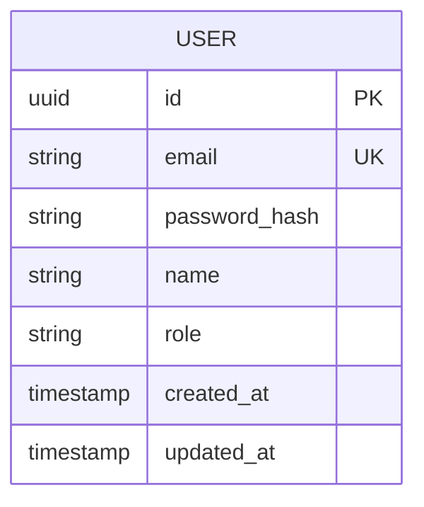

# ER Diagram: {{project_name}}

## Legend
- **PK**: Primary Key
- **UK**: Unique Key
- **FK**: Foreign Key
- **||--o{**: One-to-Many
- **}o--o{**: Many-to-Many
- **||--||**: One-to-One

## Notes
- All tables use UUID primary keys by default
- All tables include created_at and updated_at timestamps
- Soft delete via deleted_at timestamp where applicable
