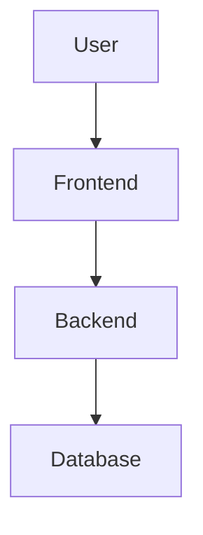

# System Specification Document: {{project_name}}

## 1. System Overview
> Brief description of the system's purpose and scope.

## 2. User Roles & Permissions

| Role | Description | Permissions |
|------|-------------|-------------|
| Admin | System administrator | Full access |
| User | Regular user | Basic access |

## 3. Functional Modules

### 3.1 {{module_name}}
- **Description**: What this module does.
- **Use Cases**:
  1. {{use_case}} — Actor performs action → System responds.
- **Inputs**: {{data_received}}
- **Outputs**: {{data_returned}}
- **Constraints**: {{business_rules, validations}}

### 3.2 {{module_name}}
...

## 4. Data Flow

## 5. Non-functional Requirements
- **Performance**: {{response_time, throughput}}
- **Security**: {{auth, encryption, data_protection}}
- **Scalability**: {{expected_growth, architecture_decisions}}
- **Availability**: {{uptime_target}}

## 6. Appendix
- Glossary of terms
- References to external documents
