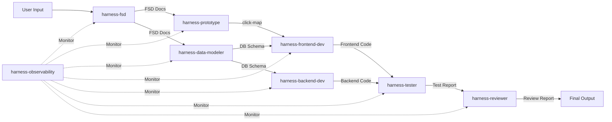

# Pipeline Dashboard: {{run_id}}

> **Project**: {{project_name}}
> **Workflow**: {{workflow_name}}
> **Started**: {{started_at}}
> **Duration**: {{total_duration}}

## Pipeline Status

```mermaid
gantt
    title Pipeline Execution — {{run_id}}
    dateFormat HH:mm:ss
    axisFormat %H:%M:%S
    section Requirements
        harness-fsd           :fsd, 00:00:00, 2m
    section Prototype + Data
        harness-prototype     :proto, after fsd, 1m
        harness-data-modeler  :dm, after fsd, 1m
    section Code Generation
        harness-frontend-dev  :fe, after proto, after dm, 5m
        harness-backend-dev   :be, after dm, 4m
    section Testing
        harness-tester        :test, after fe, after be, 2m
    section Review
        harness-reviewer      :review, after test, 1m
```

## Agent Execution Summary

| # | Agent | Phase | Status | Duration | Tokens | Schema ✓ |
|---|-------|-------|--------|----------|--------|----------|
| 1 | harness-fsd | requirements | ✅ | 2.3s | 1,500 | ✅ |
| 2 | harness-prototype | prototype | ✅ | 1.0s | 900 | ✅ |
| 3 | harness-data-modeler | modeling | ✅ | 1.1s | 800 | ✅ |
| 4 | harness-frontend-dev | generation | ✅ | 5.2s | 3,200 | ✅ |
| 5 | harness-backend-dev | generation | ✅ | 4.1s | 2,600 | ✅ |
| 6 | harness-tester | testing | ✅ | 1.8s | 1,100 | ✅ |
| 7 | harness-reviewer | review | ✅ | 0.9s | 400 | ✅ |

## 产物统计

| 目录 | 文件数 | 状态 |
|------|--------|------|
| fsd/ | {{fsd_count}} | {{fsd_status}} |
| prototype/ | {{prototype_count}} | {{prototype_status}} |
| design/ | {{design_count}} | {{design_status}} |
| backend/ | {{backend_count}} | {{backend_status}} |
| frontend/ | {{frontend_count}} | {{frontend_status}} |
| tests/ | {{tests_count}} | {{tests_status}} |
| reviews/ | {{reviews_count}} | {{reviews_status}} |

## Data Flow



## Token Usage

| Agent | Input Tokens | Output Tokens | Total | Model |
|-------|-------------|---------------|-------|-------|
| harness-fsd | 400 | 1,100 | 1,500 | deepseek/deepseek-v4-flash-0731 |
| harness-prototype | 300 | 600 | 900 | deepseek/deepseek-v4-pro-0813 |
| harness-data-modeler | 300 | 500 | 800 | deepseek/deepseek-v4-flash-0731 |
| harness-frontend-dev | 1,200 | 2,000 | 3,200 | deepseek/deepseek-v4-pro-0813 |
| harness-backend-dev | 1,000 | 1,600 | 2,600 | deepseek/deepseek-v4-pro-0813 |
| harness-tester | 400 | 700 | 1,100 | deepseek/deepseek-v4-flash-0731 |
| harness-reviewer | 200 | 200 | 400 | deepseek/deepseek-v4-flash-0731 |
| **Total** | **3,800** | **6,700** | **10,500** | — |

## Errors & Warnings

{{#if errors}}
| Severity | Agent | Message |
|----------|-------|---------|
{{/if}}

*No errors. Pipeline completed successfully.*

---
*Output location: docs/observability/ — one report set per session*
