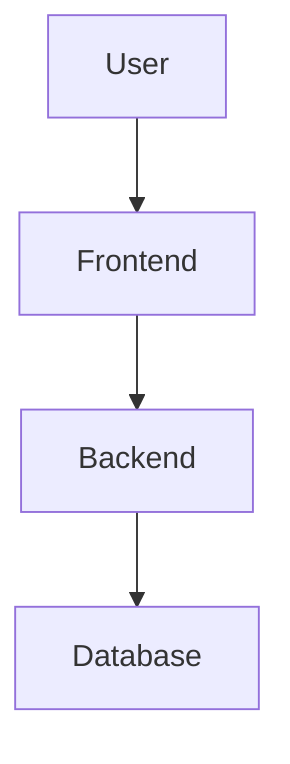

# System Specification Document: {Project Name}

## 1. System Overview
> Brief description of the system's purpose and scope.

## 2. User Roles & Permissions

| Role | Description | Permissions |
|------|-------------|-------------|
| Admin | System administrator | Full access |
| User | Regular user | Basic access |

## 3. Functional Modules

### 3.1 {Module Name}
- **Description**: What this module does.
- **Use Cases**:
  1. {Use Case} — Actor performs action → System responds.
- **Inputs**: {Data received}
- **Outputs**: {Data returned}
- **Constraints**: {Business rules, validations}

### 3.2 {Module Name}
...

## 4. Data Flow

## 5. Non-functional Requirements
- **Performance**: {Response time, throughput}
- **Security**: {Auth, encryption, data protection}
- **Scalability**: {Expected growth, architecture decisions}
- **Availability**: {Uptime target}

## 6. Appendix
- Glossary of terms
- References to external documents
